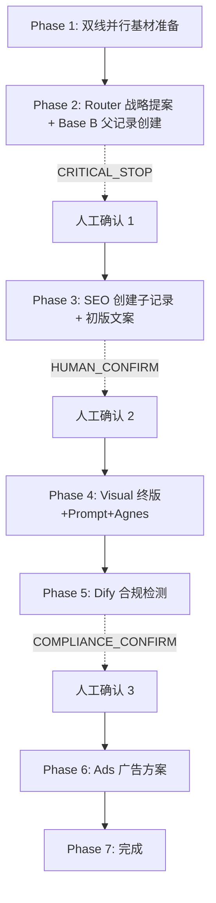

# SOP.md — 人工审核流程说明（最终版本）

**版本**：2.0
**适用**：OPC 多 Agent Listing 生成全流程

---

## 总览

本系统采用 **主控 Orchestrator + N 个子 Agent** 架构，流水线全自动协作，但**关键节点必须经人工闸门确认**后才能继续。

---

## 最终流水线全貌

---

## 详细阶段

### Phase 1：双线并行基材准备（自动，无需确认）

| 线路 | Agent | 动作 | 产出 |
|------|-------|------|------|
| **采集线** | 00_Scraper (HiCustom + 1688) | 解析商品页 → 写入飞书 Base A 输入字段（含 `source_platform` 区分） | `spu_fetched` 事件 |
| **关键词线** | 05_Keyword_Grader | 检查/构建 SPU 级词库 → 生成 T1-T5 分层快照 YAML | `keyword_snapshot_ready` 事件 |

> **关键点**：两线**完全并行**，互不阻塞。Router 等待**双方都就绪**后才启动。

---

### Phase 2：Router 战略提案 + Base B 父记录创建（需确认 #1 — CRITICAL_STOP）

- **Agent**：01_Router
- **前置依赖**：`spu_fetched` + `keyword_snapshot_ready` 均已收到
- **动作**：
  1. 读取飞书 Base A 输入字段 + 关键词快照 → 生成 `SPU_CONTEXT` YAML
  2. **在 Base B 创建父记录**：`product_name` = 完整商品名
  3. 写入战略/平台/赛道/视觉方向字段到父记录
- **闸门**：**CRITICAL_STOP** — Router 提案后必须等待人工说"确认"才能继续
- **超时**：300s 无确认 → 主控通知用户
- **产出**：`proposal_ready` 事件（含 `parent_record_id`）

---

### Phase 3：SEO 创建子记录 + 初版文案（需确认 #2 — HUMAN_CONFIRM）

- **Agent**：02_SEO_to_Listing (单一 Agent 处理 Amazon/Etsy/eBay 三平台)
- **动作**：
  1. 读取 `SPU_CONTEXT` + 关键词快照 → 经 keyword-grader 取词/冻结快照
  2. **在 Base B 父记录下创建子记录**：
     - **Listing A（子）**：`product_name` = "完整商品名-A方向"（方向A设计方案）
     - **Listing B（子）**：`product_name` = "完整商品名-B方向"（方向B设计方案）
  3. 生成三平台初版文案到对应子记录
     - Amazon：标题 / Bullet Points / Description / ST / FAQ
     - Etsy：标题 / Tags / Description / Materials
     - eBay：标题矩阵 / Item Specifics / Description
- **闸门**：**HUMAN_CONFIRM** — 三平台初版后必须等待人工确认
- **产出**：`child_records_created` 事件（含 `parent_record_id`、子记录 ID 列表、方向后缀）+ `draft_done` 事件

---

### Phase 4：终版 + 视觉 Prompt + Agnes AI 生成（无需确认，可随时干预）

- **Agent**：03_Visual
- **动作**：
  1. 读取各子记录初版 + VisualBridge → 生成终版标题/五点/描述到对应子记录
  2. 生成视觉 Prompt（Amazon/Etsy/eBay 各 Img1~7）到对应子记录
  3. 生成 A+ Copy/Prompt (01~10) 到对应子记录
  4. **可选**：调用 Agnes AI 文生图/图生图/文生视频生成预览素材
- **新增**：遵循 `knowledge-base/video-templates/video_script_standard.md` 标准化视频脚本
- **产出**：`visual_final` 事件（含视觉 Prompts、A+ 内容、Agnes 生成物 URL、目标子记录 ID）

---

### Phase 5：Dify 合规检测（需确认 #3 — COMPLIANCE_CONFIRM）

- **触发**：主控收到 `visual_final` → 组装载荷 → 调用 Dify Compliance API
- **扫描范围**：所有平台终版文案 + 视觉 Prompts + A+ 内容（针对具体子记录）
- **三层扫描**：
  1. 关键词库扫描 (`keyword_tool.py --risk-check`)
  2. 平台专属规则扫描
  3. LLM 语义合规判断
- **风险分级**：
  - 🔴 **一级（致命/法律红线）** → **CIRCUIT_BREAK** 熔断全流水线
  - 🟠 **二级（高危/平台红线）** → 标注 ⚠️ + 给出替代词，**需用户确认"替换"**后回写到子记录
  - 🟡 **三级（中危/风格建议）** → 静默替换 / 标注建议，不阻塞流程
- **闸门**：**COMPLIANCE_CONFIRM** — 若有二级风险需用户确认替换
- **产出**：写入飞书子记录 `合规扫描报告` + `合规状态`；发布 `compliance_check_result` / `risk_hit`

---

### Phase 6：广告方案（可选，自动）

- **Agent**：04_Ads
- **动作**：读取各子记录初版标题/ST/痛点 → 生成 PPC 方案到对应子记录
- **产出**：写入子记录 `Amazon_广告方案` 字段

---

### Phase 7：完成

- 所有平台子记录终版已写入飞书
- 内容状态标记为"全案完成"
- 主控汇总报告

---

## 人工确认操作指南

### 在对话中
直接说：
- "确认" / "继续" / "通过" / "OK" / "ok" / "confirm" / "approve"

### 在飞书中（可选）
观察 `内容状态` 字段：
- `待确认` → 你需要确认
- `初版已完成` → 等待你确认
- `合规扫描中` → Dify 运行中
- `需修正` → 有二级风险待你确认替换
- `熔断` → 一级风险，需人工介入
- `全案完成` → 无需操作

---

## 异常处理

| 异常 | 处理 |
|------|------|
| **Tabbit 额度用完** (显示"本周用量已用完") | **立即停止**一切任务，等下周重置后从断点继续 |
| **合规熔断** (一级风险) | 立即熔断全流水线，主控输出错误详情，等待人工介入 |
| **三次失败** (任意任务连续失败 3 次) | **三击出局**中断，输出错误详情，等待人工介入 |
| **无匹配关键词库** | Phase 1 关键词线发布 `keyword_prepare_failed`，主控暂停等待人工决策：新建词库 / 挂起 / 强制用近似 SPU 兜底 |

---

## 常用指令

| 指令 | 含义 |
|------|------|
| "确认" | 通过当前闸门，继续流水线 |
| "重跑" | 重新执行当前阶段（清除脏数据） |
| "跳过" | 跳过当前平台/阶段（需明确说明） |
| "暂停" | 暂停整个流水线 |
| "状态" | 查看当前 SPU 进度 |
| "合规扫描" | 手动触发 Phase 5 Dify 合规检测 |